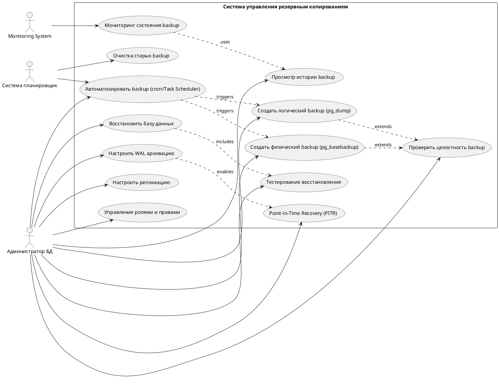

# Use Case Диаграмма - Система управления резервным копированием

## PlantUML код для генерации диаграммы

## Описание Use Case

### UC1: Создать логический backup (pg_dump)
**Актор:** Администратор БД, Система планировщик  
**Описание:** Создание полного дампа базы данных в формате SQL или custom  
**Предусловия:** PostgreSQL запущен, есть права на чтение БД  
**Постусловия:** Создан файл backup с расширением .backup или .sql  
**Основной сценарий:**
1. Администратор запускает скрипт `pg_dump_backup.bat`
2. Система проверяет подключение к БД
3. Система создает backup в указанной директории
4. Система проверяет целостность созданного backup
5. Система логирует результат операции

### UC2: Создать физический backup (pg_basebackup)
**Актор:** Администратор БД, Система планировщик  
**Описание:** Создание бинарной копии всего кластера БД  
**Предусловия:** PostgreSQL запущен, настроена репликация  
**Постусловия:** Создан физический backup в формате TAR  
**Основной сценарий:**
1. Администратор запускает скрипт `pg_basebackup.bat`
2. Система подключается к primary серверу
3. Система копирует файлы data directory
4. Система архивирует WAL файлы
5. Система создает tar.gz архив

### UC3: Восстановить базу данных
**Актор:** Администратор БД  
**Описание:** Восстановление БД из резервной копии  
**Предусловия:** Существует валидный backup  
**Постусловия:** БД восстановлена до состояния на момент backup  
**Основной сценарий:**
1. Администратор выбирает backup file
2. Система останавливает приложения
3. Система дропает существующую БД
4. Система создает новую БД
5. Система восстанавливает данные из backup
6. Система проверяет целостность данных

### UC4: Настроить WAL архивацию
**Актор:** Администратор БД  
**Описание:** Настройка непрерывной архивации WAL файлов  
**Предусловия:** PostgreSQL установлен  
**Постусловия:** WAL файлы автоматически копируются в архив  
**Основной сценарий:**
1. Администратор редактирует postgresql.conf
2. Система устанавливает wal_level = replica
3. Система устанавливает archive_mode = on
4. Система настраивает archive_command
5. Система перезапускает PostgreSQL

### UC5: Настроить репликацию
**Актор:** Администратор БД  
**Описание:** Настройка Master-Standby репликации  
**Предусловия:** Два сервера PostgreSQL  
**Постусловия:** Standby сервер синхронизируется с Master  
**Основной сценарий:**
1. Администратор настраивает Master сервер
2. Администратор создает пользователя репликации
3. Администратор создает базовый backup для Standby
4. Администратор настраивает Standby сервер
5. Система начинает потоковую репликацию

### UC7: Автоматизировать backup
**Актор:** Администратор БД, Система планировщик  
**Описание:** Настройка автоматического выполнения backup по расписанию  
**Предусловия:** Скрипты backup готовы  
**Постусловия:** Backup выполняются автоматически  
**Основной сценарий:**
1. Администратор создает задачу в Task Scheduler (Windows) или cron (Linux)
2. Система настраивает расписание (ежедневно/еженедельно)
3. Система добавляет триггеры запуска
4. Планировщик запускает backup в назначенное время

### UC8: Мониторинг состояния backup
**Актор:** Monitoring System (Prometheus + Grafana)  
**Описание:** Отслеживание состояния backup и алерты  
**Предусловия:** Prometheus и Grafana настроены  
**Постусловия:** Администратор получает уведомления о проблемах  
**Основной сценарий:**
1. Система собирает метрики backup операций
2. Система проверяет возраст последнего backup
3. Система проверяет размер backup файлов
4. Система отправляет алерты при проблемах
5. Grafana визуализирует статистику backup

### UC10: Просмотр истории backup
**Актор:** Администратор БД  
**Описание:** Просмотр списка всех созданных backup  
**Предусловия:** Backup файлы существуют  
**Постусловия:** Администратор видит список доступных backup  
**Основной сценарий:**
1. Администратор открывает веб-интерфейс
2. Система сканирует директории backup
3. Система показывает таблицу с датой, размером, типом backup
4. Администратор может фильтровать и сортировать список

## Актеры

### Администратор БД
- **Роль:** Управление резервным копированием и восстановлением
- **Права:** Полный доступ ко всем функциям системы
- **Обязанности:** 
  - Создание и восстановление backup
  - Настройка репликации и WAL
  - Мониторинг состояния системы
  - Тестирование процедур восстановления

### Система планировщик (Task Scheduler/cron)
- **Роль:** Автоматическое выполнение backup по расписанию
- **Права:** Выполнение скриптов backup
- **Обязанности:**
  - Запуск ежедневных логических backup
  - Запуск еженедельных физических backup
  - Очистка старых backup файлов

### Monitoring System (Prometheus + Grafana)
- **Роль:** Мониторинг и визуализация состояния backup
- **Права:** Чтение метрик и логов
- **Обязанности:**
  - Сбор метрик о backup операциях
  - Визуализация статистики
  - Отправка алертов при проблемах

## Визуализация

Скопируйте код PlantUML выше на сайт:
- **PlantUML Online:** http://www.plantuml.com/plantuml/
- **PlantText:** https://www.planttext.com/

Или используйте расширение PlantUML в VS Code.

